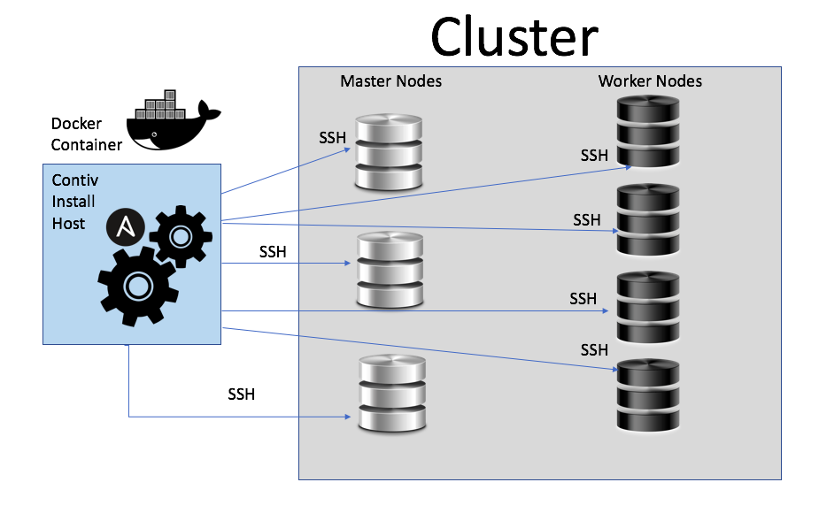

# Contiv Installation for Docker Swarm & Kubernetes 1.4+
Install Contiv on your Docker Swarm or Kubernetes cluster.
## Docker Swarm Installation
### Prerequisites
* CentOS 7.x operating system
* Docker installed on the host where you are running the installer.
* Install a Docker Swarm cluster or use the Contiv installer to install the scheduler stack after installing Docker on a node external to the cluster where the scheduler stack is being installed.

### Contiv Installation

The Contiv Docker Swarm installer is launched from a host external to the cluster.  All the nodes must be accessible to the Contiv Ansible-based installer host through SSH.

* Download the installer bundle:  `curl -L -O https://github.com/contiv/install/releases/download/$VERSION/contiv-$VERSION.tgz` 
If your access to the Internet is limited or slow and you want to download the full Contiv install, choose  
`contiv-full-$VERSION.tgz` 
Note: The full image contains only Contiv components. Installing Docker Swarm will need Internet connectivity.
* Extract the install bundle  `tar oxf contiv-$VERSION.tgz`.
* Change directories to the extracted folder  `cd contiv-$VERSION`
* To install Contiv with Docker Swarm:  `./install/ansible/install_swarm.sh -f cfg.yml -e <ssh key> -u <username> -i`
* To install Contiv with Docker Swarm and ACI:  `./install/ansible/install_swarm.sh -f aci_cfg.yml -e <ssh key> -u <username> -i -m aci`
* Example host config files are available at install/ansible/cfg.yml and install/ansible/aci_cfg.yml
* To see additional install options and examples, run  `./install/ansible/install_swarm.sh -h`.

### Removing Contiv

If you need to remove Contiv from Docker Swarm and return to your original state, you can uninstall Contiv with the following commands:
* To uninstall Contiv and Docker Swarm: 
`./install/ansible/uninstall_swarm.sh -f cfg.yml -e <ssh key> -u <username> -i`
* To uninstall Contiv and Docker Swarm with ACI support: 
`./install/ansible/uninstall_swarm.sh -f aci_cfg.yml -e <ssh key> -u <username> -i -m aci`
* To uninstall Contiv and not Docker Swarm: 
`./install/ansible/uninstall_swarm.sh -f cfg.yml -e <ssh key> -u <username>`
* Note: Adding the `-r` flag, will cleanup any Contiv state.

## Kubernetes 1.4 Installation

### Prerequisites

* CentOS 7.x operating system
* Install Kubernetes 1.4:
  1. Contiv service-cidr is currently 10.254.0.0/16. `kubeadm init` step needs to be called with the `--service-cidr 10.254.0.0/16` parameter.
  2. kubeadm installs the latest Kubernetes version. To install the latest supported version use the `--use-kubernetes-version v1.4.7` parameter. 
     See an example script [here.](https://github.com/contiv/install/blob/master/cluster/k8s1.4/k8smaster_centos.sh)
  3. Replace step (3/4) in the kubeadm install guide with the following Contiv Installation Instructions. Contiv installation can be done after completing step (4/4).
  4. Instructions to install Kubernetes 1.4 are available [here.](http://kubernetes.io/docs/getting-started-guides/kubeadm/)
  5. **NOTE:** A recent kubeadm update has rendered the latest kubeadm unable to install Kubernetes 1.4. To workaround this issue, please use kubeadm version 1.6.0-0.alpha or earlier.
     Example pre-built RPMs are available as shown [here.](https://github.com/contiv/install/blob/master/cluster/k8s1.4/bootstrap_centos.sh#L22-L26)

### Contiv Installation
* Run the following commands on the kubernetes master host.
* Use curl to get the installer bundle:  `curl -L -O https://github.com/contiv/install/releases/download/$VERSION/contiv-$VERSION.tgz`
* Extract the install bundle  `tar oxf contiv-$VERSION.tgz`.
* Change directories to the extracted folder  `cd contiv-$VERSION`
* To install Contiv with VXLAN:  `sudo ./install/k8s/install.sh -n $CONTIV_MASTER`
* **NOTE:** Use the same IP for CONTIV_MASTER as you use for --api-advertise-addresses in kubeadm init.
* To install Contiv specifying a data plane interface for VLAN:  `sudo ./install/k8s/install.sh -n $CONTIV_MASTER -v <data plane interface like eth1>`
* **NOTE:** Ensure that the data plane interface is the same on all the worker nodes.
* To install Contiv with ACI:  `./install/k8s/install.sh -n $CONTIV_MASTER -a <APIC URL> -u <APIC User> -p <APIC Password> -l <Leaf Nodes> -d <Physical Domain> -e <EPG Bridge domain> -m <APIC contracts unrestricted mode>
  `   For example:   `./install/k8s/install.sh -n <netmaster DNS/IP> -a https://apic_host:443 -u apic_user -p apic_password -l topology/pod-xxx/node-xxx -d phys_domain -e not_specified -m no
  `
   where `$CONTIV_MASTER` is the Contiv proxy or Net Master IP.
* To see additional install options, run   `./install/ansible/install.sh`.

### Removing Contiv
* To uninstall Contiv, retaining the etcd state, run: 
`sudo ./install/k8s/uninstall.sh`
* To uninstall Contiv, cleaning up the etcd state, run: 
`sudo ./install/k8s/uninstall.sh etcd-cleanup`.  Use this option to cleanup all the Contiv network state. 
* To stop Contiv, go to the install folder contiv-$VERSION and run:  `kubectl delete -f .contiv.yaml`
* To start Contiv, go to the install folder contiv-$VERSION and run:  `kubectl apply -f .contiv.yaml`
* To remove etcd state when Contiv is stopped, run:   `rm -rf /var/etcd/contiv-data`
